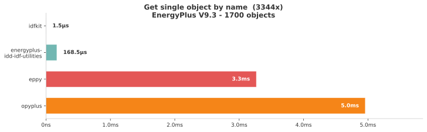

# idfkit

[](https://github.com/idfkit/idfkit/releases)
[](https://github.com/idfkit/idfkit/actions/workflows/main.yml?query=branch%3Amain)
[](https://codecov.io/gh/idfkit/idfkit)
[](https://github.com/idfkit/idfkit/blob/main/LICENSE)

**A fast, modern EnergyPlus IDF/epJSON toolkit for Python.**

> [!IMPORTANT]
> **The next release renames how you write a model to disk.** `write_idf(doc, path)`
> becomes `save_idf(doc, path)`, and `write_epjson(doc, path)` becomes
> `save_epjson(doc, path)`. `write_*` now only returns a string.
>
> Worth knowing before you upgrade, because neither failure names the cause:
> `write_epjson(doc, path)` raises `TypeError: can't multiply sequence by
> non-int of type 'PosixPath'`, and `write_idf(doc, path)` fails silently,
> writing nothing and leaving an empty file that surfaces later as
> `Could not detect EnergyPlus version in file`.
>
> Search for `write_idf(` and `write_epjson(` called with two positional
> arguments, or run a type checker, which rejects both. Full notes in the
> [changelog](CHANGELOG.md#migration).

> [!NOTE]
> idfkit is in **beta**. The API may change between minor versions. We're looking
> for early adopters and testers — especially users of eppy who want
> better performance and a modern API. If you try it out, please
> [open an issue](https://github.com/idfkit/idfkit/issues) with feedback,
> bug reports, or feature requests.

idfkit lets you load, create, query, and modify EnergyPlus models with an
intuitive Python API. It is designed as a drop-in replacement for
[eppy](https://github.com/santoshphilip/eppy) with better performance,
built-in reference tracking, and native support for both IDF and epJSON
formats.

## Key Features

- **O(1) object lookups** — Collections are indexed by name, so
  `doc["Zone"]["Office"]` is a dict lookup, not a linear scan.
- **Automatic reference tracking** — A live reference graph keeps track of
  every cross-object reference. Renaming an object updates every field that
  pointed to the old name.
- **IDF + epJSON** — Read and write both formats; convert between them in a
  single call.
- **Schema-driven validation** — Validate documents against the official
  EnergyPlus epJSON schema with detailed error messages.
- **Built-in 3D geometry** — `Vector3D` and `Polygon3D` classes for surface
  area, zone volume, and coordinate transforms without external dependencies.
- **EnergyPlus simulation** — Run simulations as subprocesses with structured
  result parsing (SQLite, CSV, HTML, and a fast pure-Python `.eso`/`.mtr`
  reader), batch processing, and content-addressed caching.
- **Weather data** — Search ~17,300 weather stations (~70,000 TMYx datasets), download EPW/DDY files,
  and apply ASHRAE design day conditions.
- **Async & batch simulation** — Run simulations concurrently with
  `async_simulate` or process parameter sweeps with `simulate_batch`.
- **3D visualization** — Render building geometry to interactive 3D views or
  static SVG images with no external tools.
- **Schedule evaluation** — Parse and evaluate EnergyPlus compact, weekly, and
  holiday schedules to time-series values.
- **Thermal properties** — Gas mixture and material thermal calculations for
  glazing and construction analysis.
- **Broad version support** — Bundled schemas for every EnergyPlus release
  from v8.9 through v26.1.

## Performance

idfkit is designed from the ground up for speed. On a **1,700-object IDF**,
looking up a single object by name is **over 3000x faster** than eppy and opyplus
thanks to O(1) dict-based indexing:

<picture>
  <source media="(prefers-color-scheme: dark)" srcset="docs/assets/benchmark_dark.svg">
  <source media="(prefers-color-scheme: light)" srcset="docs/assets/benchmark.svg">
  
</picture>

See [full benchmark results](https://developers.idfkit.com/benchmarks/)
for all six operations (load, get by type, get by name, add, modify, write) across four tools.

## Installation

Requires **Python 3.10+**.

```bash
pip install idfkit
```

Or with [uv](https://docs.astral.sh/uv/):

```bash
uv add idfkit
```

### Optional extras

| Extra | Install command | What it adds |
|-------|----------------|--------------|
| `weather` | `pip install idfkit[weather]` | Refresh weather station indexes from source (openpyxl) |
| `dataframes` | `pip install idfkit[dataframes]` | DataFrame result conversion (pandas) |
| `s3` | `pip install idfkit[s3]` | S3 cloud storage backend (boto3) |
| `plot` | `pip install idfkit[plot]` | Matplotlib plotting |
| `plotly` | `pip install idfkit[plotly]` | Plotly interactive charts |
| `progress` | `pip install idfkit[progress]` | tqdm progress bars for simulations |
| `all` | `pip install idfkit[all]` | Everything above |

## Quick Example

```python
from idfkit import load_idf, save_idf

# Load an existing IDF file
doc = load_idf("in.idf")

# Query objects with O(1) lookups
zone = doc["Zone"]["Office"]
print(zone.x_origin, zone.y_origin)

# Modify a field
zone.x_origin = 10.0

# See what references the zone
for obj in doc.get_referencing("Office"):
    print(obj.obj_type, obj.name)

# Write back to IDF (or epJSON)
save_idf(doc, "out.idf")
```

> **Note:** `load_idf()` defaults to strict parsing (`strict=True`) and raises
> `IDFParseError` on malformed objects. Use `strict=False` only as a tolerant
> migration/compatibility fallback for legacy or noisy files.

### Creating a model from scratch

```python
from idfkit import new_document, save_idf

doc = new_document()
doc.add("Zone", "Office", x_origin=0.0, y_origin=0.0)
save_idf(doc, "new_building.idf")
```

## Simulation

```python
from idfkit.simulation import simulate

result = simulate(doc, "weather.epw", design_day=True)

# Query results from the SQLite output
ts = result.sql.get_timeseries(
    variable_name="Zone Mean Air Temperature",
    key_value="Office",
)
print(f"Max temp: {max(ts.values):.1f}°C")
```

> **Note:** `result.sql` requires EnergyPlus to produce SQLite output (the
> default). See the [Simulation Guide](https://developers.idfkit.com/simulation/)
> for details on output configuration.

## Weather

```python
from idfkit.weather import StationIndex, geocode

index = StationIndex.load()
results = index.nearest(*geocode("Chicago, IL"))
print(results[0].station.display_name)
```

## CLI

`pip install idfkit` ships an `idfkit` command with three subcommands:

- `idfkit check` — static lint for cross-version EnergyPlus breakage ([docs](https://developers.idfkit.com/concepts/version-compatibility/))
- `idfkit migrate` — forward-migrate an IDF through `IDFVersionUpdater` ([docs](https://developers.idfkit.com/simulation/migrating-versions/))
- `idfkit tmy` — search and download TMYx weather data from the shell ([docs](https://developers.idfkit.com/cli/tmy/))


## The JavaScript sibling

idfkit has a sibling library for JavaScript and TypeScript,
[idfkit-js](https://github.com/idfkit/idfkit-js), published as `@idfkit/core`.
The two share a vocabulary and are held to a
[conformance corpus](https://developers.idfkit.com/explanation/conformance/)
that proves they read and write the same files the same way.

They are not equivalent, and this page will not imply that they are. All
thirteen first-tier capabilities exist in both: parsing, the object model,
references, writers, schema access, validation, introspection, documentation
addresses, generated object types, parse diagnostics, the weather station index,
weather file retrieval, and geocoding. Almost everything else on this page is
Python-only today, including running EnergyPlus locally, reading simulation
results, geometry authoring, zoning, schedules, thermal properties, and
migration. Some of that is a port not yet done; some of it, such as driving a
locally installed EnergyPlus, is permanent.

[Capability parity](https://developers.idfkit.com/explanation/parity/) is the
record. It lists every public capability, its state in each language, and
whether an absence is temporary or permanent, and a check blocks any change that
lands or removes a capability without updating it. Read it rather than inferring
from the shared name.

Matching version numbers between the two are never evidence of agreement: they
release independently. What each release states is the conformance level it
passes, readable as `idfkit.CONFORMANCE_LEVEL`.

## Documentation

Full documentation is available at
**[developers.idfkit.com](https://developers.idfkit.com/)**, which teaches both
languages from one navigation. `py.idfkit.com` is retired and redirects there.

Key sections:

- [Getting Started](https://developers.idfkit.com/getting-started/installation/) — Installation, quick start, interactive tutorial
- [Simulation Guide](https://developers.idfkit.com/simulation/) — Run EnergyPlus, parse results, batch processing
- [Weather Guide](https://developers.idfkit.com/weather/) — Station search, downloads, design days
- [API Reference](https://developers.idfkit.com/api/document/) — Complete API documentation
- [Migrating from eppy](https://developers.idfkit.com/migration/) — Side-by-side comparison

### For AI coding assistants

idfkit ships agent-readable reference docs in
[`src/idfkit/.agents/skills/developing-with-idfkit/`](src/idfkit/.agents/skills/developing-with-idfkit/SKILL.md).
The directory is packaged in the wheel, so it's also accessible from an
installed copy via `importlib.resources.files("idfkit") / ".agents"`.
The [idfkit plugin](https://github.com/idfkit/idfkit-plugin) packages them as
the `developing-with-idfkit` skill for Claude Code, Cursor, Copilot, Gemini, and
Codex: it resolves the idfkit installed in your project and loads the references
baked into that exact version.

## Development

```bash
make install    # Install dependencies and pre-commit hooks
make check      # Run linting, formatting, and type checks
make test       # Run tests with coverage
make docs       # Serve documentation locally
```

## Contributing

Contributions are welcome! Please see [CONTRIBUTING.md](CONTRIBUTING.md) for guidelines.

## License

This project is licensed under the MIT License — see [LICENSE](LICENSE) for details.
